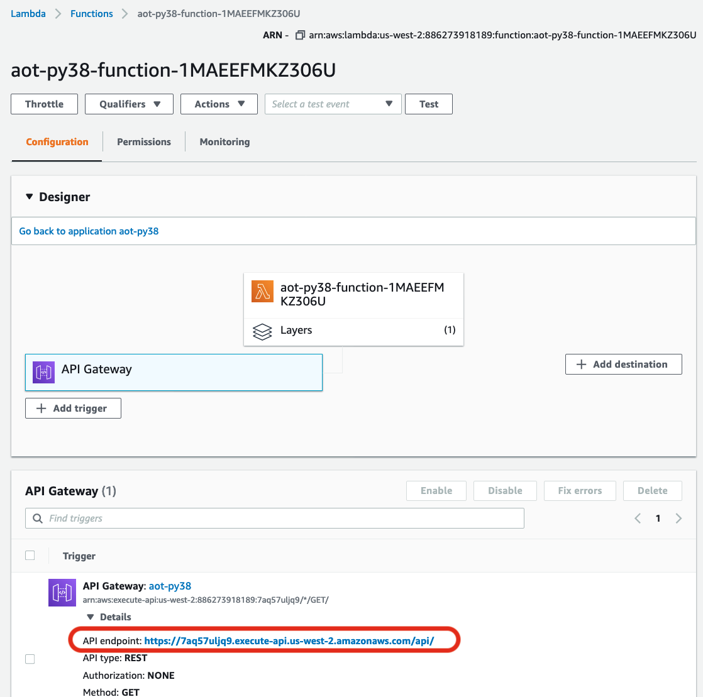
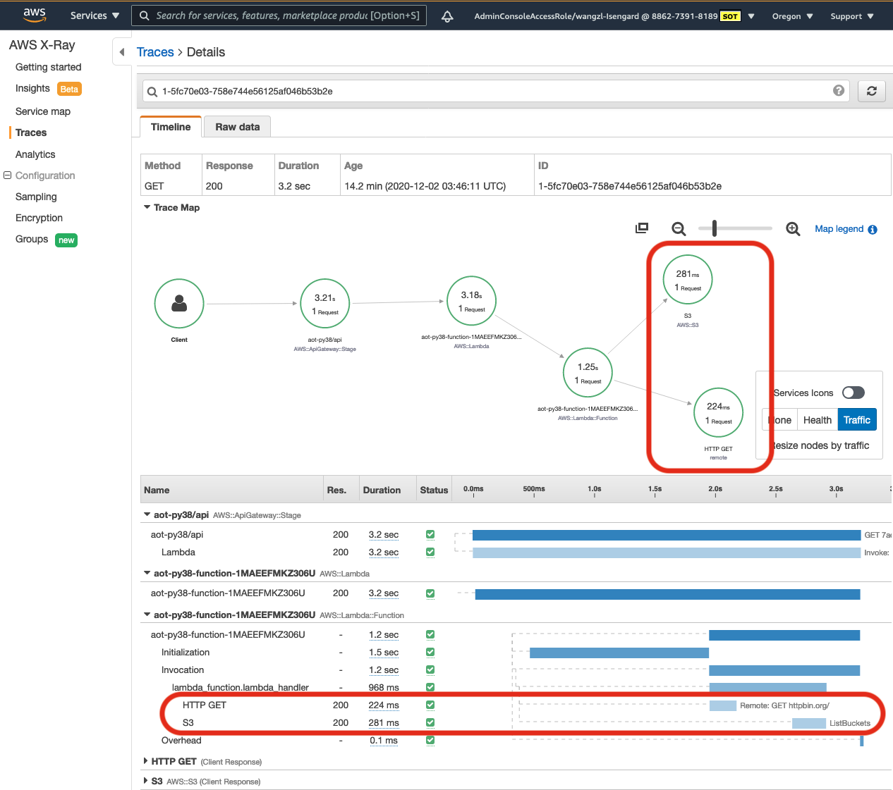
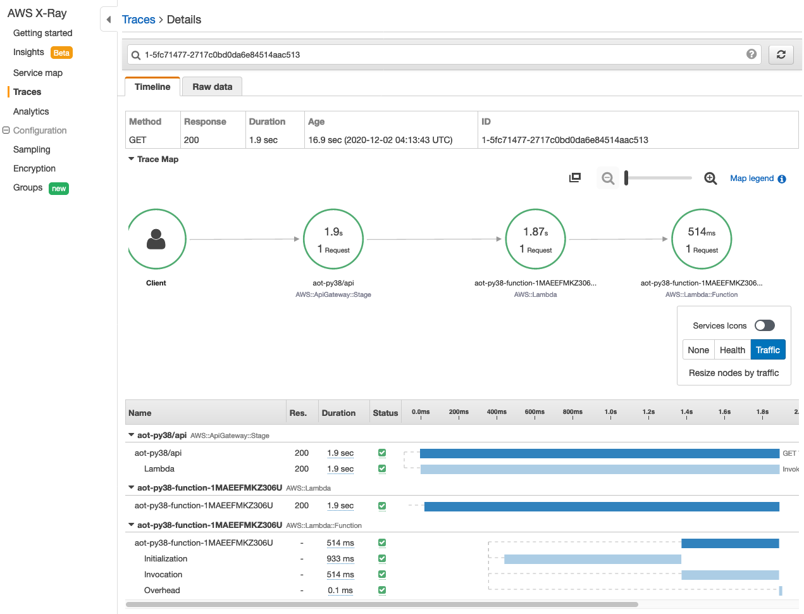
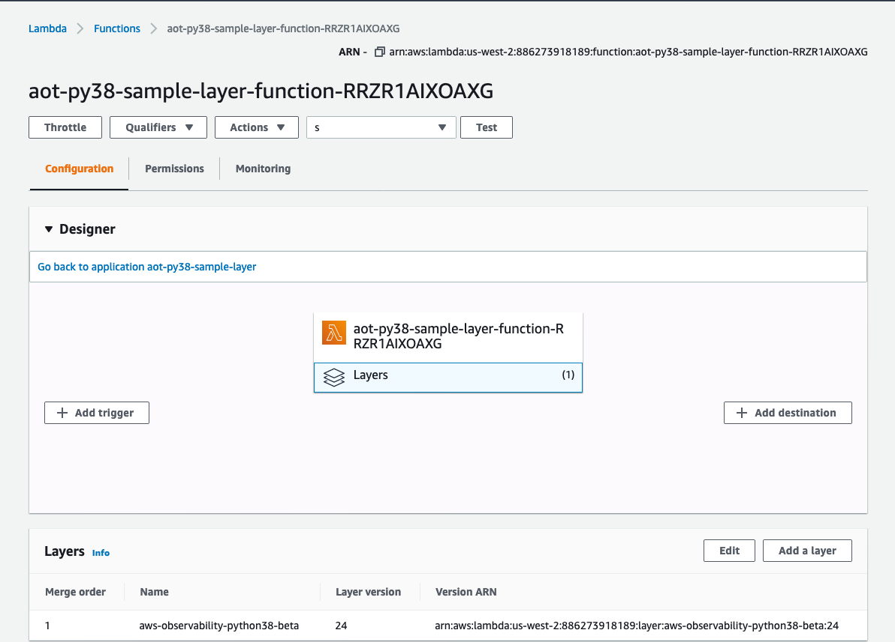
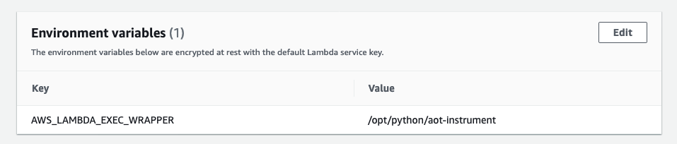
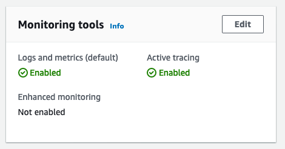

# AWS Distro for OpenTelemetry Lambda Support (Python) 
The AWS Distro for OpenTelemetry(ADOT) [Lambda layer](https://docs.aws.amazon.com/lambda/latest/dg/configuration-layers.html) provides a plug and play user experience by automatically instrumenting a Lambda function. Users can onload and offload OpenTelemetry from their Lambda function without changing code.


## Sample
This sample will create AWS Distro for OpenTelemetry Lambda Layer and a sample application in region us-west-2 in your AWS account. By default the traces are sent to AWS X-Ray, you can see telemetry data generated by OpenTelemetry from AWS X-Ray.
- Install [SAM CLI](https://docs.aws.amazon.com/serverless-application-model/latest/developerguide/serverless-sam-cli-install.html) and [AWS CLI](https://docs.aws.amazon.com/cli/latest/userguide/install-cliv2.html). For users have trouble in SAM CLI, see [documentation](docs/misc/sam.md).
- Run `aws configure` to set aws credential([with administrator permissions](https://docs.aws.amazon.com/serverless-application-model/latest/developerguide/serverless-sam-cli-install-mac.html#serverless-sam-cli-install-mac-iam-permissions)) and default region.
- Download a local copy of the [aws-otel-lambda repository from Github](https://github.com/aws-observability/aws-otel-lambda).
- Run command: `cd sample-apps/python-lambda && ./run.sh -r us-west-2`
- Open [Lambda console](https://us-west-2.console.aws.amazon.com/lambda/home?region=us-west-2#/functions) in us-west-2, find the new Lambda function `adot-py38-sample-function-...`
the source code of Lambda function contains an aio http request and an AWS SDK request(S3)
    <details><summary>source code</summary>

    ```python
    def lambda_handler(event, context):

        loop = asyncio.get_event_loop()
        loop.run_until_complete(callAioHttp())

        for bucket in s3.buckets.all():
            print(bucket.name)

        return {"statusCode": 200}
    ```
    </details>

- Invoke Lambda function by clicking the API endpoint in API Gateway, Details
    <details>

    

    </details>

- Open [X-Ray console](https://us-west-2.console.aws.amazon.com/xray/home?region=us-west-2#/traces?timeRange=PT1H), click the latest Trace ID, will see the http request and AWS SDK request are instrumented.

    <details>

    

    </details>

- Back to [Lambda console](https://us-west-2.console.aws.amazon.com/lambda/home?region=us-west-2#/functions), remove the environment variable `AWS_LAMBDA_EXEC_WRAPPER` from Lambda function.
- Click the API endpoint in API Gateway -> Details again.
- In X-Ray console, retrieve the latest Traces, will see ADOT is offloaded.

    <details>

    

    </details>

- Open [CloudFormation console](https://us-west-2.console.aws.amazon.com/cloudformation/home?region=us-west-2#/stacks?filteringText=&filteringStatus=active&viewNested=true&hideStacks=false), clean the sample resources by **Delete** stack `adot-py38-sample`.

***

## Getting started
To play ADOT auto-instrumentation in Python3.8 Lambda Runtime, the following steps are required: 1. Build the Lambda layer; 2. Enable auto-instrumentation for your Lambda function.

### Build the Lambda layer
If you have went though Sample you already have ADOT Lambda layer, skip to the next step **Enable auto-instrumentation for your Lambda function**

1. Install [SAM CLI](https://docs.aws.amazon.com/serverless-application-model/latest/developerguide/serverless-sam-cli-install.html) and [AWS CLI](https://docs.aws.amazon.com/cli/latest/userguide/install-cliv2.html). For users have trouble in SAM CLI, see [documentation](docs/misc/sam.md).
2. Run `aws configure` to set aws credential([with administrator permissions](https://docs.aws.amazon.com/serverless-application-model/latest/developerguide/serverless-sam-cli-install-mac.html#serverless-sam-cli-install-mac-iam-permissions)) and default region.
2. Download a local copy of the [aws-otel-lambda repository from Github](https://github.com/aws-observability/aws-otel-lambda).
3. cd sample-apps/python-lambda && ./run.sh -t layer.yml

Tips:
- `run.sh -t layer.yml` will compile ADOT layer in local and publish it to personal account. If need both ADOT layer and Sample app, use `./run.sh`
- Lambda layer is regionalized. To publish ADOT layer to other regions use `-r`, for example `./run.sh -r us-west-2`
- Query the layer ARN by `./run.sh -l`. If want to query the layer ARN in region us-east-1, use `./run.sh -l -r us-east-1`(suppose you have built and published ADOT layer in this region)
- After the layer is published, it can be reused across multiple Lambda functions. You don’t have to republish the layer, unless you would like to upgrade the layer to the latest version.


### Enable auto-instrumentation for your Lambda function

Now you have the layer ARN. To enable the AWS Distro for OpenTelemetry in your Lambda function, you need to add and configure the layer, and then enable tracing.

#### Option #1 Enable ADOT by Console

1. Open the Lambda function you intend to instrument in the in AWS console. In the **Layers in Designer** section, choose **Add a layer** Under **specify an ARN** paste the layer ARN, and then choose **Add**.

    <details>

    

    </details>

2. Add environment variable `AWS_LAMBDA_EXEC_WRAPPER = /opt/python/adot-instrument` in Lambda function.

    <details>

    

    </details>

3. Enable tracing

    <details>

    

    </details>


#### Option #2 Enable ADOT by [CloudFormation template](https://docs.amazonaws.cn/en_us/lambda/latest/dg/configuration-layers.html#configuration-layers-cloudformation)

```yaml
      Environment:
        Variables:
          AWS_LAMBDA_EXEC_WRAPPER: /opt/python/adot-instrument
      Tracing: Active
      Layers:
        - <ADOT layer ARN>
```

#### Option #3 Enable ADOT by [AWS CLI](https://docs.aws.amazon.com/cli/latest/reference/lambda/update-function-configuration.html)

```shell
aws lambda update-function-configuration --function-name <your lambda function name> --layers <ADOT layer ARN> --environment Variables="{AWS_LAMBDA_EXEC_WRAPPER=/opt/python/adot-instrument}" --tracing-config "Mode=Active"
```
Tips:
- By default, the layer is configured to export traces to AWS X-Ray, make sure your Lambda role has [the required X-Ray permissions](template.yml#L23).
- The command `aws lambda update-function-configuration` will override Lambda layer and environment variables in existing function. If your function already has other layers and environment variables, you need to add them in the wrapper command. For example, if your function has an environment variable `A=a`, the command should be `--environment Variables="{AWS_LAMBDA_EXEC_WRAPPER=/opt/python/adot-instrument,A=a}"`. For more information, see the [AWS CLI documentation](https://docs.aws.amazon.com/cli/latest/reference/lambda/update-function-configuration.html).


### Remove OpenTelemetry from your Lambda function
To disable OpenTelemetry from you Lambda function, remove the Lambda layer and remove the environment variable `AWS_LAMBDA_EXEC_WRAPPER`. Also, disable active tracing.


***

## Configuration
The AWS Distro for OpenTelemetry Python Lambda layer combines both OpenTelemetry Python SDK and the [AWS Distro for OpenTelemetry Collector](https://github.com/aws-observability/aws-otel-collector#overview). The configuration of Collector follows the OpenTelemetry standard.

By default, AWS Distro for OpenTelemetry in Lambda uses [config.yaml](https://github.com/aws-observability/aws-otel-lambda/blob/main/extensions/aoc-extension/config.yaml), which exports telemetry data to AWS X-Ray and AWS CloudWatch.

For debugging, you can turn on the logging exporter in the Collector by adding the environment variable `ADOT_DEBUG=true` in the Lambda function.

To customize the Collector config, there are two options:

* Bring custom config file (and ca/cert/key files) into the Lambda function by the Lambda layer, then set the Collector config by environment variable `ADOT_CONFIG=<your config file path>`
* Add the environment variable `ADOT_CONFIG_CONTENT=<Full content of your config file>`

For more information about AWS Distro for OpenTelemetry Collector configuration like adding ca/cert/key files, see the Github [README.md](../../extensions/sample-custom-config/README.md).

#### Environment variables

- `AWS_LAMBDA_EXEC_WRAPPER` - Set to `/opt/python/adot-instrument` to enable ADOT Python auto-instrumentation. For more details see [Lambda Wrapper scripts documentation](https://docs.aws.amazon.com/lambda/latest/dg/runtimes-modify.html#runtime-wrapper).
- `ADOT_DEBUG` - Set to `true` can turn on OpenTelemetry ConsoleExporter in SDK and logging exporter in Collector, to output more details in log for debug.
- `ADOT_CONFIG` - AWS Distro for OpenTelemetry Collector configuration file path.
- `ADOT_CONFIG_CONTENT` - AWS Distro for OpenTelemetry Collector configuration file content.
- `_ADOT_CI` - Reserved environment variable in ADOT CI.

    
***

## Security

See [CONTRIBUTING](CONTRIBUTING.md#security-issue-notifications) for more information.

## License

This project is licensed under the Apache-2.0 License.

