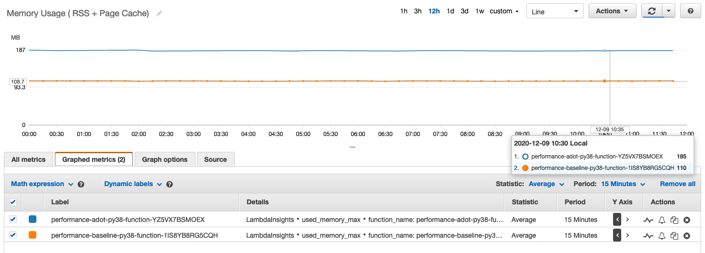
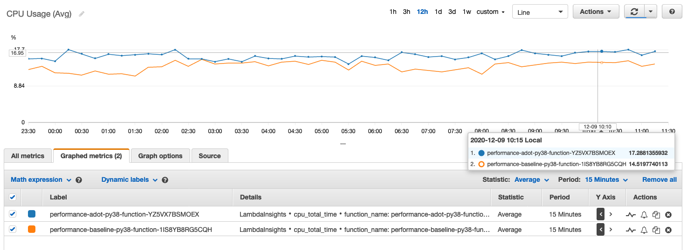
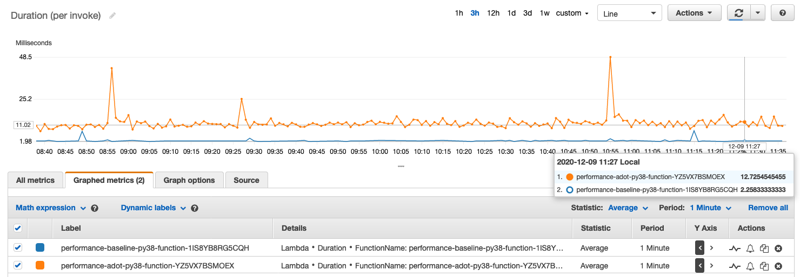

## ADOT Lambda layer End to End Performance

### Prerequisites
1. Lambda runtime Python3.8, memory is 512 MB, concurrency is 1, active tracing.
2. Lambda function is empty, simply return `200 OK`.
    <details><summary>source code</summary>

      ```python
      def lambda_handler(event, context):

          return {"statusCode": 200}
      ```
     </details>
3. Enable [LambdaInsights](https://aws.amazon.com/about-aws/whats-new/2020/10/announcing-amazon-cloudwatch-lambda-insights-preview/) to monitor memory usage and CPU usage.
4. Create an AWS API Gateway before Lambda, run `./distribute.sh -s <stack_name> -n 100000` to trigger Lambda in a continuous loop.
5. Create a duplicated Lambda but no ADOT as the baseline.

### Performance Test
**performance-adot-py38-function-YZ5VX7BSMOEX** enable ADOT, instrument Lambda function by OpenTelemetry and send traces to AWS X-Ray.

**performance-baseline-py38-function-1IS8YB8RG5CQH** same code and setting but does not have ADOT.

#### Memory


#### CPU


#### Duration per invoke


---

### Conclusion

The memory usage of ADOT in Lambda is around 75 MB (185 - 110 baseline). Need to clarify that memory consumption in AWS Lambda is high-water mark, includes both RSS and Cache. Among of them the Cache size is approximately equal to the size of ADOT Lambda layer. So, the RSS is less than 20 MB. For the best performance please reserve 75 MB memory for ADOT.

CPU usage increases 2.5%, not only OpenTelemetry Python SDK but an OpenTelemetry Collector is running in Lambda through Lambda Extensions API.

The duration increases 10 ms because there is a synchronous AWS SDK call at the end of every single Lambda invocation. Lambda will freeze the entire environment if no new request coming. There is no signal for freeze, to prevent traces is blocked in buffer, the current solution is call force_flush() API to flush data synchronously.

